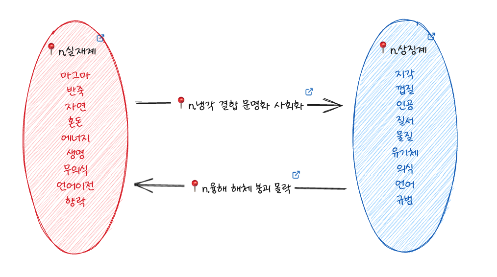

# 동형적 사고와 은유

현대사상에서 뗄 수 없는 사고방식이 있다면 동형성을 이용한 사고방식이다. 이는 오만한 구조주의적 사고방식을 아주 간단한 방식을 통해 벗어나 더욱 추상적인 층위에서 서로다른 이미지가 녹아내리며 섞여 새로운 사고의 가능성을 강제하는 힘을 갖고있다.

이를 위한 개념으로 다음의 세가지가 필요하다.

### 동형(수학)

> **동형 사상**(isomorphism)은 서로 구조가 같은 두 대상 사이에, 모든 구조를 보존하는 사상이다. 두 대상 사이에 동형 사상이 존재하는 경우 서로 **동형**(isomorphic)이라고 하며, 서로 동형인 두 대상은 구조가 같아 구조로서 구별할 수 없다.

### 가족유사성(비트겐슈타인)

> 어떤 본질이나 명확한 규칙을 통해 정의될 수 있는 공통점을 공유하지는 않으나 서로 닮은 부분이 있어서 연결되는 관계성
> **불확정적인 언어적 경계 속에서 생겨나는 다양한 앎의 가능성을 생각할 수 있다**

### 개념

> **개념**은 여러 관념 중에서 공통적이고 일반적인 요소를 추출하고 종합하여 얻은 보편적인 관념을 말한다.
> 개념은 모두 외계 대상의 공통된 징표를 반영하고 있다.

세가지 개념 모두 어떤 대상들에게서 공통을 추출해내는 행위를 각기 다르게 설명하고 있다는걸 알 수 있다.

먼저 사과의 개념을 떠올려보자. 우리는 사과라는 관념을 개념화시키기 이전에 어떤 그림을 보거나 맛을 보고 또 촉각적 경험을 통해 다양한 사과의 감각정보들을 데이터셋으로 가지게 된다. 이는 개별적 사과의 데이터셋으로, 각 감각정보들을 묶어내며 대표되는 감각정보를 기반으로 사과라는 개념적 이미지를 형성한다.

| 사과     | 색     | 맛   | 질감     | 모양     | 상태   |
| -------- | ------ | ---- | -------- | -------- | ------ |
| 1 | 빨간색 | 달다 | 반들반들 | 동그란   | 신선   |
| 2 | 갈색   | 쓴맛 | 푸석푸석 | 쭈글쭈글 | 오래된 |
| 3 | 초록   | ...  |       |          |        |

즉 사과라는 개념은 하나의 감각정보를 모아놓은 데이터집합이며, 여러 감각정보의 집합을 묶은 집합의 집합으로 볼 수 있다. 여기서 대표되는 감각정보는 소통의 컨텍스트에 따라 달라지기도 한다.

이처럼 하나의 지시적 개념은 감각정보 혹은 경험정보를 묶은 집합에 대표되는 요소들을 묶은 하나의 데이터 셋으로 기능할 때가 많으며, 이 데이터셋에 사과라는 이름이 붙으면서 세부요소에 대한 설명 없이 개념데이터의 바운더리를 형성한다. 

사과의 경우처럼 개념 자체에 이름이 있는 경우도 있지만 이름이 없는 경우도 존재한다. `가족유사성` 개념은 "어떤 본질이나 명확한 규칙을 통해 정의될 수 있는 공통점을 공유하지는 않으나 서로 닮은 부분이 있어서 연결되는 관계성"을 말하고 있다. 남이었던 사람들이 가족으로 묶이면서 어떤 공통적인 특징을 보여주는 인지적 경향성을 말한다. 이는 개념에도 똑같이 적용된다.

책 <라캉 바디우 들뢰즈의 세계관>에서는 이런 사고를 매우 적나라하게 보여주고 있다.

```ts
집합1 = [마그마, 초콜릿반죽, 에너지, 자연, 무의식, 실재계, ... ]
집합2 = [지각, 껍질, 물질, 인공, 의식, 상징계, ... ]
```

이 두 집합은 개념들의 집합으로 어떠한 이미지를 형성한다. 이 이미지는 명확히 정의되지 않으며 요소들에 의해 불확정적 경계를 갖지만 여전히 이미지로서 융합된 유사성을 얻어낼 수 있다. 이 이미지는 대표개념을 추출해내기 힘들기 때문에 개념적으로 익명성을 갖음과 동시에 사용되는 맥락에 따라 대표되는 용어가 달라진다. 

위 집합들의 요소는 순서에 맞게 페어되는데, (마그마, 지각), (에너지, 물질) 등으로 나타낼 수 있으며 각 페어된 요소의 관계를 함수로 정의하면

```ts
[R1(x, y), R2(y, x)] = [
	[응고(마그마, 지각), 융해(지각, 마그마)],
	[응고(초콜릿반죽, 껍질), 융해(껍질, 초콜릿반죽)],
	[결합(에너지, 물질), 붕괴(물질, 에너지)],
	[문명화(자연, 인공), 원시화(인공, 자연)],
	...
]
```

위와같이 나타낼 수 있다.

여기서 관계함수들의 집합을 만든다면 다음과 같다.

```ts
관계집합1 = [응고, 결합, 문명화, 언어화, ...]
관계집합2 = [융해, 붕괴, 원시화, 이미지화, ...]
```

관계집합에서도 마찬가지로 익명개념으로 종합하여 하나의 어떤 이미지를 얻어낼 수 있다.

여기서 정의된 관계 R1, R2는 익명의 관계 종합으로서 각 페어요소의 관계와 **구조적 동형성**을 갖는다.



빨간원이 집합1, 파란원이 집합2, 오른쪽 화살표가 관계1, 왼쪽 화살표가 관계2를 말한다.

전혀 동일하지 않지만, 구조적으로 동일한 두요소의 페어들을 각각 모으면, 새로운 익명개념과 익명관계가 나타나는데, 이 익명개념을 통해 우리는 관찰너머의 비경험지대를 추측해낼 수 있다. 이는 매우 문학적이라고 볼 수 있는데, 시나 소설에서 등장하는 비유 은유와 다르지 않기 때문이다. 그것들은 늘 익명개념과 익명관계를 통해 컨텍스트를 점프하며 이야기를 진행시킨다.

