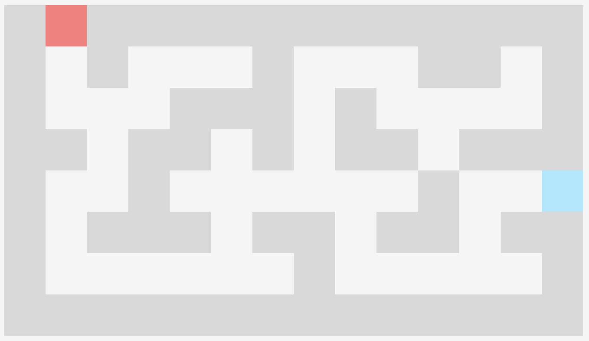
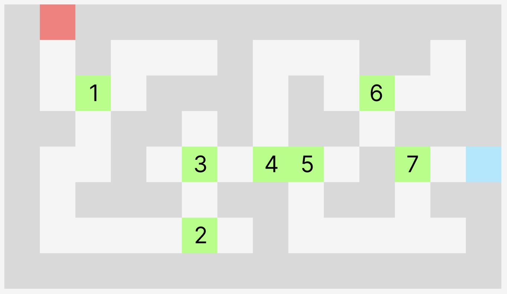
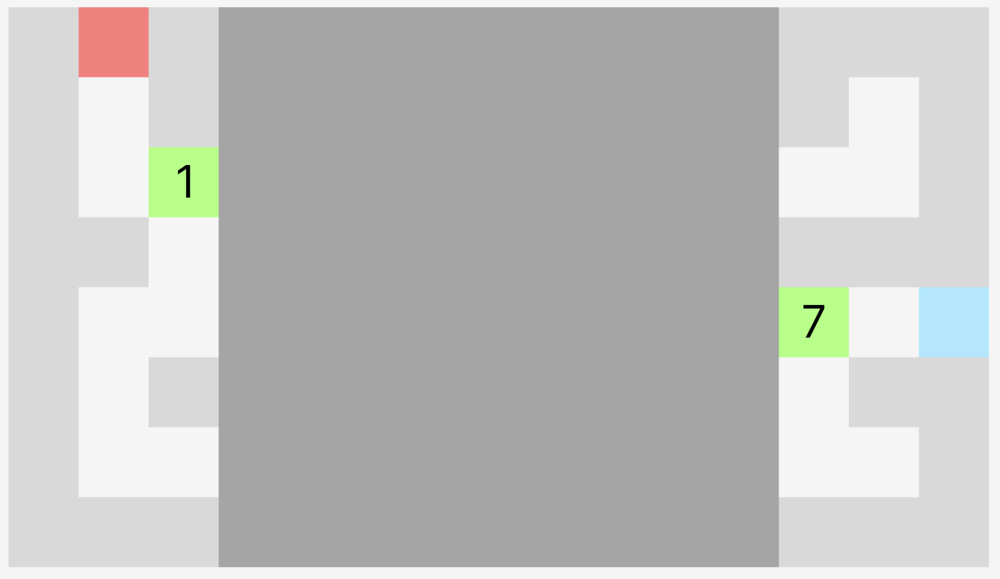
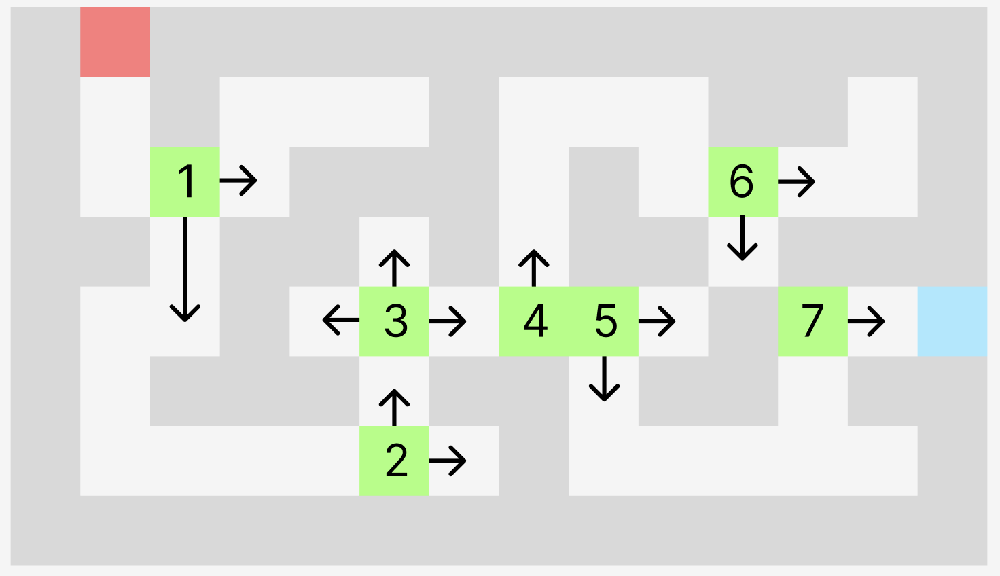
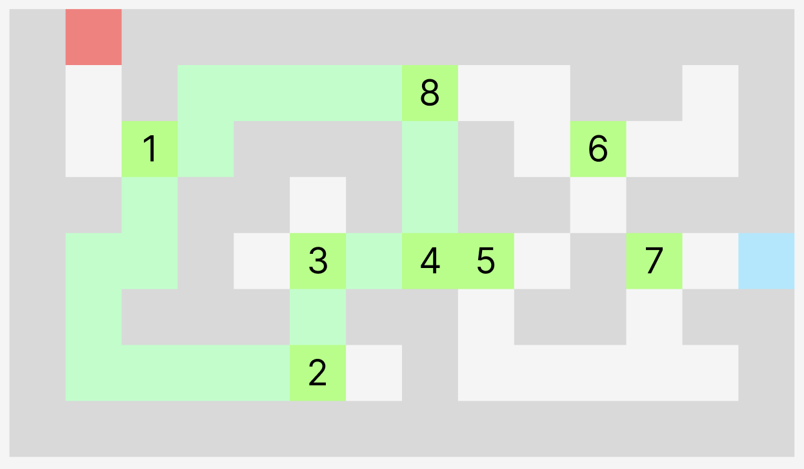

# 영감과 대화, 경로탐색

## 영감의 개념

우리는 각자가 학습한 대로의 개념을 갖고 있다. 여기서 개념이란 실제적이거나 추상적 관념의 한 단위로, 그 자체로 추상적이나, 어떤 다른 개념, 관념, 경험 연결될 때, 그 쓰임새를 보여주게 된다. 즉, 개념은 독립적이고 단독적으로 존재한다기보다 무언가와 연결되는 분기점의 역할을 하기도 한다.

영감이란 개념 자체도 사용되는 맥락에 따라 해석이 달리 되게 마련이다. 영감이란 표현은 대게 종교나 예술에서 많이 사용되는데, 종교에서는 신이 내려준 지혜나 생각을 뜻하고, 예술에서는 창조적인 일의 계기가 되는 빼어난 착상이나 자극을 말한다. 그리고 우리는 대화하면서 영감을 얻는다는 표현을 종종 하게 된다.

영감은 학습된 개념이 가진 연결경로 이외의 새로운 경로(한 개념의 새로운 시각 혹은 사용 방법)를 발견하게 되는 순간이거나, 혹은 기존의 연결경로를 수정하는 경우, 혹은 개념 자체의 정의를 수정하는 경우 등을 예로 들 수 있다. 이러한 변화를 총체적으로 다시 보면 영감은 결국, 인지된 개념이 변화되는 과정과 매우 연관이 깊다는 것을 알 수 있다. 개념변화의 과정은 학습 과정 그 자체를 의미한다.

즉 영감은 학습의 본질 위에서 작동한다는 것을 알 수 있다.

영감이 대화하면서 많이 발생하는 이유도 교수학습의 원리와 같다. 타인의 말을 집중해서 듣는 행위, 몰입해서 이해하는 과정을 통해, 타인이 사용하는 개념이 어떤 상황 어떤 맥락에서 무엇과 어떻게 연결 적용되는지를 이해하는 과정에서 내가 이전에 미처 학습하지 못한 사용성이나 시각을 깨닫고 이해하게 되고, 이를 통해 영감을 얻어 새로운 활동이 유발된다. 이 새로운 활동을 통해 기존의 개념에 새로운 시각과 연결되기도 하며, 기존의 연결 과정을 뒤엎어 내기도 한다. 이 과정 교육의 본질과 맞닿아 있다. 그래서, 교육의 상당 부분은 대화로 구성돼 왔다.

학습의 관점에서 책이 더 많은 영감을 줄 수 있겠지만, 대부분 사람은 대화하면서 영감을 얻는다고 한다. 이유는 간단하다, 책은 나를 이해하고 피드백을 줄 수 없지만, 사람은 어느 정도 가능하기 때문이다. 그래서 책이 더 위대한 영감을 줄 수 있을지언정 독자를 고려해서 정보를 제공하지 않기 때문에 우리는 많은 영감을 대화에서 얻어낸다.

그럼, 대화와도 같이 사람들에게 영감을 제공할 수 있는 수단은 없을까? 책처럼 모든 걸 다 읽어야만 이게 똥인지 된장인지 구별할 수 있지 않고, 사람처럼 나에게 필요한 영감을, 개념적 학습 가능 지점을 찾아낼 방법은 없을까?

## 택시와 네비게이션

내비게이션이 없던 시절에는 택시 기사의 지식은 그 자체로 엄청난 가치가 있었다. 지금에야 택시의 지식보다 내비게이션을 더 믿는 시대가 되었지만, 내비게이션이 없던 시절, 지도과 위치에 관한 지식은 사회적으로 늘 높은 가치를 인정받아 왔다.

더 이전의 시대로 거슬러 올라간다면, 지도가 없던 시대와 지도가 있는 시대로 나눠 생각해 볼 수 있는데, 지도가 없던 시대에는 유경험자의 지리적 정보의 가치가 매우 높은 평가를 받았다. 
상인들은 늘 사람들과 대화하며 어디에 어떤 물건이 있는지 어디에 어떤 물건이 필요한지 경험하여 학습하고 그 정보가 정확할수록 더 큰 부를 얻을 수 있게 되었다.
그뿐만 아니라, 지리적 정보는 군사전략의 가장 핵심이 되는 정보다. 전쟁에 앞서 고지대를 미리 선점해 낸다면, 강한 이점을 가질 수밖에 없는 게, 각종 투사체의 사거리가 길어질 뿐만 아니라 전투 시 체력적으로도 우위를 점할 수 있었다.

현대에 이르러 이런 지리적 정보를 데이터베이스에 넣고, 원하는 위치에 도달하는 최단 경로를 산출해 주거나, 최소시간경로를 추천받을 수 있게 되었다.

하지만, 우리 교육은 아직도 전통 방식 그대로를 벗어나지 못하고 있다.

교육은 개념이 변화되어 가는 과정이고, 개념은 연결가능한 경로의 한 분기점으로 추상화시킬 수 있다면, 개념에 대한 지도도 충분히 만들어 낼 수 있을 뿐만 아니라, 내비게이션도 만들어 낼 수 있다.

비약이 있는데 비약을 채워보자. 개념이 왜 분기점이란 말일까?

## 개념과 문제해결

앞서 언급했듯 개념과 문제해결은 미로에서 길 찾기와 굉장히 연관이 깊다. 애초에 개념을 사고하는 뇌의 뉴런 연결구조 자체가 아주 복잡한 미로처럼 구성돼 있기 때문이다.

우리가 무언가에 대해 생각하게 되면 생각의 경로를 따라가다 개념적 분기점에 이르게 되고, 분기점에서 한 경로를 선택하여 개념의 이어서 생각하곤 하는데 이 과정은 뉴런이 정보를 처리하는 과정과 일치한다. 뉴런은 자극받은 전기적 신호를 연결된 뉴런 중 특정 경로에 선택적으로 전기적 신호를 보낼 수 있고, 이때 활성화된 경로의 뉴런이 해당 경로와 연결된 회로를 가동하면서 집중의 요소를 한 방향으로 제한시킨다.

우리 뇌는 무엇에 대해 생각하면서 끊임없이 분기점 사이에서 길 찾기를 하는 것과 같다. 그리고 문제해결을 잘 해내려면 개념이 가진 연결경로가 모두 학습되어 있을수록 유리하다.

하나의 문제상황은 문제해결에 앞서 여러 가지 해답이 있을 수 있지만 아무 데나 가도 늘 문제를 맞힐수 있는 것은 아니다. 특정 방법들 안에서만 문제가 해결되는 경로가 존재하고, 그 경로의 분기점에는 이 개념을 어떻게 활용해야 할지, 어떤 방식으로 바라봐야 할지, 어떻게 활용해야 할지, 개념 사용의 경로를 선택해야만 한다.

그래서 문제해결의 가장 중요한 점은 개념이 가진 경로의 전체적 특성을 얼마나 잘 이해하고 있는가, 이 시도가 먹히지 않는다면 어떤 시도를 할 수 있을 것인가? 라는 물음들의 연속과도 같다. 만약 개념학습이 잘 되어있지 않다면, 개념 연결성에 제한이 생기고 이 제한이 생긴 경로를 사용해야만 풀리는 문제에서 늘 막다른 골목에서 서성이게 될 수밖에 없는 것이다.

이를 해결하기 위해 선인들은 그리고 성공한 사람들은 늘 책을 보라고 말하지만, 지식의 적합성이 늘 잘 맞는 것은 아니고 그러다 보니 당장 필요한 몇 가지 개념을 얻어내기 위해 해당 분야의 전문서적 10권 이상의 책을 학습해야만 한다.

마치 내비게이션이 없던 시절에 전혀 모르는 곳에 도달하려고, 이 사람 저 사람 물어물어 열 사람 이상의 전문가에게 물어 정보를 취합해서 모험을 떠나는 것과 같다. 이게 작금 교육의 형태다. 전문가에게 물을 수 있으면 다행이나, 거의 무한대로 쏟아져 나오고 있는 수많은 강의들 사이를 여전히 떠돌아야만 한다.

컨텐츠가 엔트로피의 법칙을 순리대로 따르며 무한히 증식하고 있는데, 우리 똑똑한 내비게이션은 증식하지 않는다. 그 비결은 정확한 데이터와 정확한 연산 처리에 있다. 미로 문제 풀이 알고리즘에 솔루션에 대한 힌트가 들어있는데, 핵심은 하이라키구조가 가지고 있다.

## 미로와 트리구조 경로탐색

위와 같은 미로가 있다고 해보자. 전체 그림을 보면 풀기 어렵지 않겠지만, 미로 안에 갇혀서 전체모습을 볼 수 없다면, 미로가 더욱 복잡해진다면 출구를 찾기 쉽지 않을 수 있다.

문제해결에는 정해진 경로를 걸어나가는 능력과 분기점에서 선택할 수 있는 모든 경로를 인지하는 능력, 그리고 잘못된 경로로 들어섰을 때, 이전에 선택했던 경로가 무엇이었는지 기억하는 능력이 필요하다.

이때 경로선택의 분기점을 개념이 필요한 상황이라고 볼 수 있었는데, 그림으로 표시하면 다음과 같다.

빨간 블럭에서 파란 블럭으로 나아가고자 할 때 분기점을 모두 표시하면 그림의 녹색 블럭과 같다. 각 분기점은 경로를 선택해야 하며, 이때 분기점이 개념을 마주했을 때, 이 개념을 어떤 방식으로 연결시킬지 선택하는 과정이라고 볼 수 있다.

만약 개념에 대한 학습이 덜 되어있어서 1번 분기점에서 아래로 가는 경로가 학습되어 있지 않다면 이 미로에서의 문제해결은 시작부터 어려움에 봉착하게 되는 것이다.

뿐만 아니라 보통 문제상황은 중간 과정이 좀처럼 보이지 않는 경우가 많다.

하지만 수많은 개념은 이미 대중에게 열려있고 정보의 바다 위에 떠돌아다니고 있다. 문제는 그 개념들이 잘 구조화되어 있지 않다는 것이다.

인터넷에는 수많은 정보가 있지만 상당수가 구조화된 정보가 아니다 보니, 방대하게 복제되고 무분별하게 쏟아져나오고 있다. 현재 언어 학습 인공지능은 이런 문서들을 사람이 정제해서 가공된 데이터를 학습시키고 있지만 여전히 계층화된 정보는 아니라는 점에서 한계점이 있다.

위의 미로처럼 명료하게 계층화시킬 수 있다면 보다 똑똑한 인공지능이 나오는 것은 자명하다.

이 그림의 미로가 왜 계층화되어 있다는 걸까?
각 분기점에서 이어지는 경로를 표시하면 위 그림과 같은데 이를 하이라키로 변환하면 다음과 같다.

이런 문제상황에 있어서, '길을 찾는다', '방법을 찾는다', '영감을 얻는다'는 말은 위 계층구조의 각 분기점에서 어떤 방향으로 나아갈지 학습한다는 개념임과 동시에 새로운 시각을 얻는다는 말과 동일하다. 기존에 학습되지 않았던 지식에 새로운 문제해결의 출구가 열린다면 동기가 되지 않을 수 없다.

컴퓨터 알고리즘은 이런 경로 탐색에 아주 효율적인 연산이 가능하다. 물론 모든 경로가 학습되어 있다는 전제조건 하에서 가능하다. 특히 하이라키 구조는 지식이 방대해져도 그 양이 점차 수렴되어 가는 양질의 정보 계층이기 때문에 연결성의 논리적 힘이 아주 강력하다고 볼 수 있다. 수학 문제를 해결할 때도 이 하이라키 경로 탐색과 정은 우리 머리속에서 그대로 나타나게 된다. 사실상 이 탐색 알고리즘 자체가 인간의 사고를 모방해서 만들었기 때문이다.

위 문제는 중3 수학인데, 고등수학의 등비수열을 이용해서 문제를 풀어도 되지만 중2 기하학의 비례식을 이용해서 문제를 풀 수 있는데 풀이 과정은 다음과 같다.

주어진 식으로부터 $S_2 = \cfrac{1}{3} S_1$ , $S_3 = \cfrac{1}{3} S_2$ 로부터 다음 항이 될 때 1/3배씩 곱해진다는 패턴을 찾아내고,

닮은 도형의 넓이의 비는 길이에 비의 제곱과 같다는 닮음 개념의 한 경로를 떠올려 닮음비를 찾아내고

$S_1 = \sqrt {3}$ 과 정삼각형의 넓이 $\cfrac {\sqrt{3}}{4}a^2$으로부터 한 변의 길이를 구하는 방정식 개념을 떠올려

나온 결과물들을 연립방정식으로 연산하면 정답을 구할 수 있다.

풀이에서와 같이 수학에서 문제해결은 각 개념의 활용을 선택하는 사전지식에 의해 문제해결에 대한 경로를 찾아내는 것과 같다. 또 수학은 엄밀하게 정돈된 하이라키 구조로 되어 있기 때문에 하나의 개념에 대해 모든 경로를 탐색했다면 더 이상 해당 영역에 대해 고민할 여지 자체가 없어지는 것이다.

로지컬 싱킹, 박문호 박사님의 집합론적 사고, 직장인들이 배우는 MECE한 사고방식까지 모두 이 트리 구조적 사고방식을 논리의 베이스에 가져가고 있다.

하지만 세상엔 트리 구조로 표현되지 않는 정보가 무수히 많다. 그럴 땐 어떻게 할까?

### 비선형 비 계층 구조, 그래프 구조에서의 경로 탐색

미로를 조금 더 변형시키면 아래와 같은 상황이 더 복잡하게 연결될 수 있게 되기도 한다.

이 미로의 경우 계층구조로 회귀하지 않는 그래프구조를 띄고 있는데, 1번 분기점과 8번 분기점이 연결됨으로서 위 1번과 8번 중 어느 분기점이 상위구조인지 명확하지 않은 경우가 발생한다. 어떤 문제를 풀다 보니 다시 처음 상황으로 되돌아오는 경우를 말한다. 이런 아일랜드형 경로가 두세 개만 얽혀있더라도 자칫 잘못하면 길을 잃어버리기 십상이다. 이런 상황에서는 문제를 해결해 나가려면 목적지의 방향으로 경로를 우선 선택하되 지나간 경로는 길목에 표시해서 찾아나가야만 한다. 헨젤과 그레텔이 집에 돌아가기 위해 마크해 둔 것처럼.

이런 상황은 컴퓨터가 더욱 전적으로 유리할 수밖에 없는데, 단시간에 모든 경로를 계산해서 최단 거리를 찾아낼 수 있기 때문이다. 심지어는 모든 경로를 탐색하지 않고도 최단 경로를 찾아내어 내비게이션처럼 길을 제공할 수 있다. 우리가 흔히 게임에서 목적지를 클릭하면 자동으로 경로 검색하는 알고리즘이 거의 실시간으로 연산 되어 즉각적으로 반응하는 모습을 볼 수 있기도 하다.

하이라키가 논리적인 힘을 만들어 준다면, 하이라키가 아닌 비선형구조의 경로 탐색 기능은, 시각정보(내비게이션)를 제공하고 효율성(최단 거리)을 제공한다.

학습에서 이런 서비스는 전문 선생님의 과외 말고는 방법이 없다. 즉 과외선생님이 해주는 교육 서비스는 지식에서의 경로 탐색 알고리즘에 가깝다는 말이다.

## 차세대 인공지능 교육 서비스

현재 인공지능은 문자 단위로 구축되어 서비스되고 있다. 인터넷에 있는 글자들의 연관정보를 입력시켜 학습해 그래프 구조에서 나름의 내비게이션 역할을 문자 단위에서 해주는 서비스이다. 하지만, 문자 단위가 아니라 사고의 기본단위는 개념이기 때문에 개념의 연결이 카테고리 없이 연결되어 학습된 수준에서 언어모델이 아니라, 개념과 개념들이 어떻게 연결되어 있는지 충분히 잘 모델링된 데이터를 토대로, 생각의 경로를 온전히 제공해 주는 서비스가 나올 수 있을 것으로 기대한다.

그렇게 하기 위해서는 보다 진보된 집단지성이 구축되어 있어야 하며, 현재의 위키백과를 뛰어넘는 더 양질의 집단지성의 장이 필요하다. 그리고 그 장에서는 하이라키와 그래프 연결이 구분되어 있어야 한다. 논리의 장 하이라키영역에서는 지식들이 끊임없이 수렴되어 최첨단의 지식과 연결되어 있으면서 동시에 생성의 장 그래프영역에서는 개인의 사소한 생각도 연결되며 확산되어야한다. 그러한 엄밀하면서 또 어설프거나 신선한 연결들의 총체는 우리를 더 나은 교육혁신의 현장으로 이끌 것이다. 굳이 인공지능이 아니라, 그냥 경로 탐색 알고리즘만으로도 말이다.
