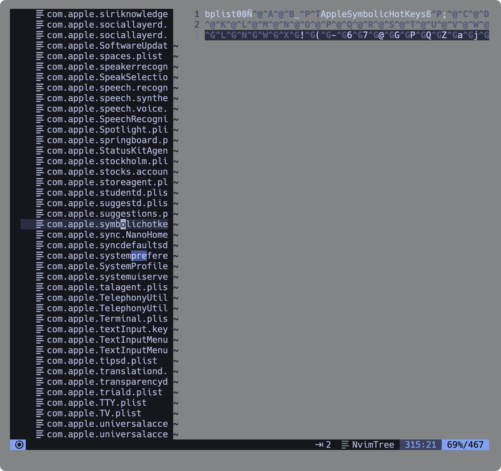
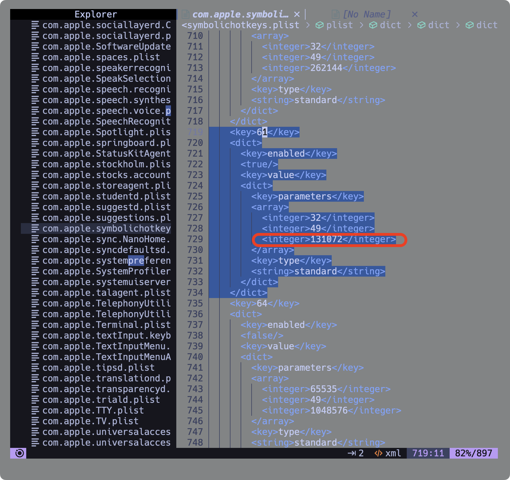

# 맥에서 한영키 전환 shift + space 로 변경하기

맥에서 한영키를 이런 저런 바인딩해서 사용하는 경우가 있는데,
`capslock`키로 바인드하는 경우 입력시간이 조금 길어지면 한영키 전환이 아닌 
대문자모드로 변경되는 경우가 있어 입력오타가 자주 발생한다.
그렇다고 기본 변환인 `ctrl` + `space` 를 사용하자니 맥북 키보드에선 
`fn` 키 앞에숨어있어서 불편하고 외장키보드를 사용한다 해도 새끼손가락을 
제법 아래까지 내려야한다는 점에서 또 불편하다.

구름 입력기를 사용하면 `shift` + `space` 키로 변경가능한 옵션을 제공하는데,
모든곳에서 전혀 문제가 없지만 빔에서 사용시 띄어쓰기가 입력된다는점이다.

다행히 맥에서는 핫키를 관리하는 파일이 있다. 해당 파일을 열어보자.

## 핫키파일



그림처럼 파일이 깨져서 나오는데, 파일이 바이너리로 컴파일 되어있기 때문이다.
이 파일은 xml 파일로 구성되어져 있으니 컨버팅이 필요하다.

## 컨버팅

```shell
plutil -convert xml1 ~/Library/Preferences/com.apple.symbolichotkeys.plist
```
## 키설정 변경



파일이 잘 보이고 이제 문제의 한영키 셋팅에 가서 수정하면 된다.
그림과 같이 `61`번 키의 내부 배열에서 마지막 숫자를 `131072`로 바꿔주자.
저장하고 이후 다시 바이너리 파일로 컨버팅이 필요하다.

## 컨버팅
```shell
plutil -convert binary1 ~/Library/Preferences/com.apple.symbolichotkeys.plist
```

이제 맥을 리부트하면 한영전환이 변경된다.
