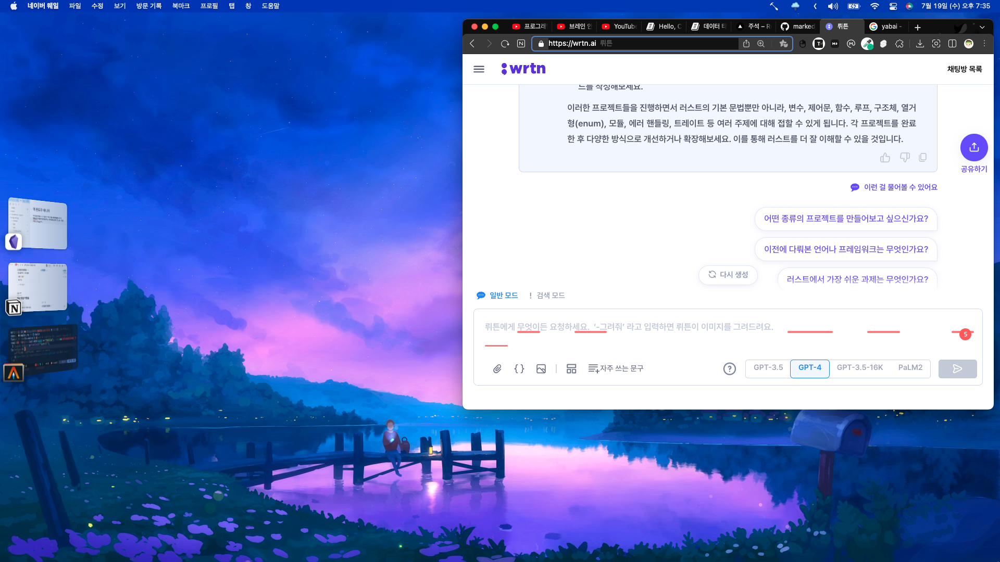
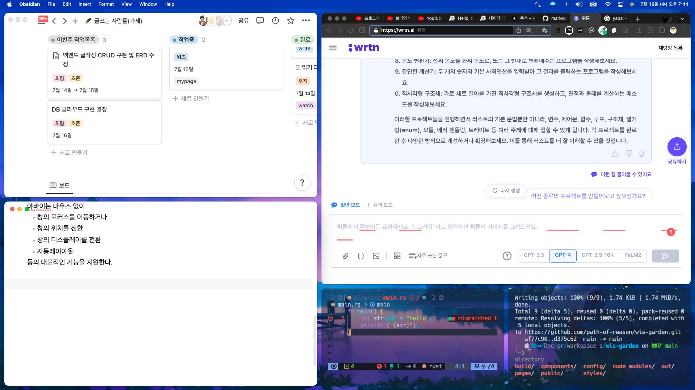

# 맥 윈도우 매니저

맥 사용자라면 누구나 윈도우 매니저를 경험해봤을 것이다.
맥에서도 기본적으로 제공되는 스테이지매니저가 있다.



그 외에도 무료 윈도우 매니저인 `Rectangle`이 아주 유명한데, 특징은 모두 마우스 전용이라는 점이다. 

개발자들은 특성상 마우스보다 키보드가 더 가깝고 익숙해서 이런 불편함을 공감하는 제작자분이 `yabai`를 만들어주었다.

## yabai
야바이는 마우스 없이
- 창의 포커스를 이동하거나
- 창의 위치를 전환
- 창의 디스플레이를 전환
- 자동레이아웃
등의 대표적인 기능을 지원한다.

사용하면 다음과 같은 화면을 볼 수 있다.


깔끔한 화면을 볼 수 있다.

### 야바이 설정
야바이 설정은 `~/.config/yabai/yabairc` 파일에 보관한다.
```conf
# bap stack or float 
yabai -m config layout bsp 

yabai -m config window_placement second_child 

# padding
yabai -m config top_padding 12
yabai -m config bottom_padding 12
yabai -m config left_padding 12
yabai -m config right_padding 12
yabai -m config window_gap 12 

# mouse settings
yabai -m config mouse_follows_focus on
yabai -m config mouse_modifier alt

# set focus follows mouse mode (default: off, options: off, autoraise, autofocus)
yabai -m config focus_follows_mouse autoraise

# left click drag move
yabai -m config mouse_action1 move

# right click drag resize
yabai -m config mouse_action2 resize

yabai -m mouse_drop_action swap

# example: show shadows only for floating windows
yabai -m config window_shadow float

# Disable specific apps
yabai -m rule --add app="^System Settings$" manage=off 
yabai -m rule --add app="^Calculator$" manage=off 
yabai -m rule --add app="^Karabiner-Elements$" manage=off
yabai -m rule --add app="^카카오톡$" manage=off 
```

야바이는 기본적으로 터미널 명령어를 통해 명령이 실행되는데 이 명령을 대신 전달해줄 키맵핑 프로그림이 필요하다. 

## skhd (simple hotkey daemon for macos)

skhd를 사용하여 야바이를 조작할 수 있다.

### 설정

```
# https://github.com/josean-dev/dev-environment-files/blob/main/.config/skhd/skhdrc
# https://github.com/koekeishiya/skhd

# Changing window focus
alt - j : yabai -m window --focus south
alt - k : yabai -m window --focus north
alt - h : yabai -m window --focus west
alt - l : yabai -m window --focus east

# Change focus between external displays
alt - s : yabai -m display --focus west
alt - g : yabai -m display --focus east

# move window to display left and right
shift + alt - s : yabai -m window --display west; yabai -m display --focus west;
shift + alt - g : yabai -m window --display east; yabai -m display --focus east;

# Rotate layout clockwise
shift + alt - r : yabai -m space --rotate 270
# flip along y-axis
shift + alt - y : yabai -m space --mirror y-axis
# flip along x-axis
shift + alt - x : yabai -m space --mirror x-axis
# toggle window float
shift + alt - t : yabai -m window --toggle float --grid 9:9:1:1:7:7

# maximize window
ctrl + alt - return : yabai -m window --toggle zoom-fullscreen
ctrl + alt - m : yabai -m window --toggle zoom-fullscreen

# space balance reset
ctrl + alt - e : yabai -m space --balance 

# swap
shift + alt - h : yabai -m window --swap west
shift + alt - j : yabai -m window --swap south
shift + alt - k : yabai -m window --swap north
shift + alt - l : yabai -m window --swap east

# move
ctrl + alt - h : yabai -m window --warp west
ctrl + alt - j : yabai -m window --warp south
ctrl + alt - k : yabai -m window --warp north
ctrl + alt - l : yabai -m window --warp east
ctrl + alt - left : yabai -m window --warp west
ctrl + alt - up : yabai -m window --warp north
ctrl + alt - down : yabai -m window --warp south
ctrl + alt - right : yabai -m window --warp east

# move window to prev and next space
shift + ctrl + alt - h : yabai -m window --space prev;
shift + ctrl + alt - l : yabai -m window --space next;
shift + ctrl + alt - left : yabai -m window --space prev;
shift + ctrl + alt - right : yabai -m window --space next;

# move window to space #
shift + alt - 1 : yabai -m window --space 1;
shift + alt - 2 : yabai -m window --space 2;
shift + alt - 3 : yabai -m window --space 3;
shift + alt - 4 : yabai -m window --space 4;
shift + alt - 5 : yabai -m window --space 5;
shift + alt - 6 : yabai -m window --space 6;
shift + alt - 7 : yabai -m window --space 7;


# stop/start/restart yabai
ctrl + alt - q : yabai --stop-service; skhd --stop-service
ctrl + alt - s : yabai --start-service; skhd --start-service;

```
