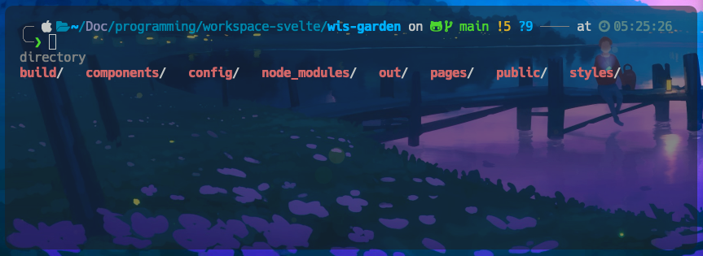

# zsh, oh my zsh

개발자라면 항상 터미널을 끼고 살게 된다. 터미널을 끼고 살다보면 기본 터미널이 가진 불편함을 지속적으로 느끼게 되는데, 선배개발자들도 마찬가지였는지 여러가지 터미널에서 유용한 도구들을 만들어두었다.

그중 하나가 지금 소개할 zsh이다.

zsh는 유닉스 계열 os에서 사용되는 텍스트 기반 쉘로 다음과 같은 기능들을 제공한다.

- 강력한 텍스트 편집 기능
- 강력한 셸 스크립팅 기능
- 강력한 자동 완성 기능
- 강력한 히스토리 기능
- 강력한 배경 작업 관리 기능
- 강력한 테마 기능

이중에서 가장 강력한 점은 이쁜 테마를 지원하는 oh-my-zsh이다.

## oh my zsh
오마이즈쉬를 깔아야 테마질을 할 수 있다.
또한 zshrc(즈쉬설정파일)에 플러그인의 이름을 입력하는것으로 플러그인 설치가 가능하다.(되는 플러그인이 있고 안되는것도 있다) 

### powerlevel10k
파워레벨은 터미널 테마를 내 입맛에 맞게 커스터마이징을 쉽게 할수있도록 지원해준다. 물론 이 방법을 쓰지 않고도 커스터마이징이 불가능하진 않지만, 파워레벨을 사용하면 몇가지 예제를 보여주면서 터미널에서 맘에 드는 숫자만 입력하면 해당 테마를 얻을 수 있도록 도와준다.

## zap
잽은 오마이즈쉬에서 사용가능한 플러그인 매니저이다.
잽을 사용하면 플러그인 관리가 매우 편리하다.

## 플러그인

## 별칭
