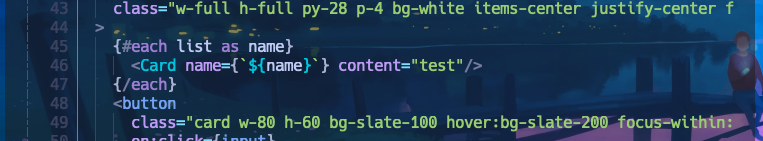

# `*` asterisk

루나빔에서 특정 변수의 이름을 모두 변경해야할 때가 있다.
이때 `*` 키의 도움을 받으면 편하다. 노멀모드에서 커서를 특정 변수명에 위치놓고 `*`
키를 누르면 자동으로 해당용어 전체를 셀렉션 해주게 된다. 일종의 매크로인 셈인데 `/변수명` 을 자동으로 입력해주어 검색을 도와주는 도구이다.

(빔에서는 노멀모드에서 `/` 키를 누르고 키워드를 입력하면 현재 활성화된 문서 전체에서 해당 키워드를 검색하고 셀렉션해준다.)

이제 셀렉트된 변수의 이름을 바꿔보자.

노멀모드인 상태로 
1. `ciw` 를 순서대로 입력하면 
   커서가 단어의 중간에 있어도 단어의 시작점부터 변경하게끔 단어를 삭제하고 인서트 모드로 전환된다. 
2. 변수의 이름을 name으로 변경하고 
3. 인서트 모드를 종료(`esc`)하면 
   방금 변환했던 행위가 빔의 `.` 매크로에 기억되어있기 때문에 반복 가능하다.
4. `n` 키를 눌러서 셀렉션된 다음 대상으로 이동할 수 있고, 
5. `.` 키로 이전에 햇던 작업을 반복하면 변수명 변환 리팩터링이 완료된다.

