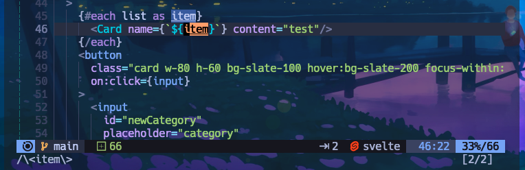
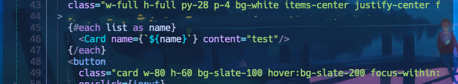
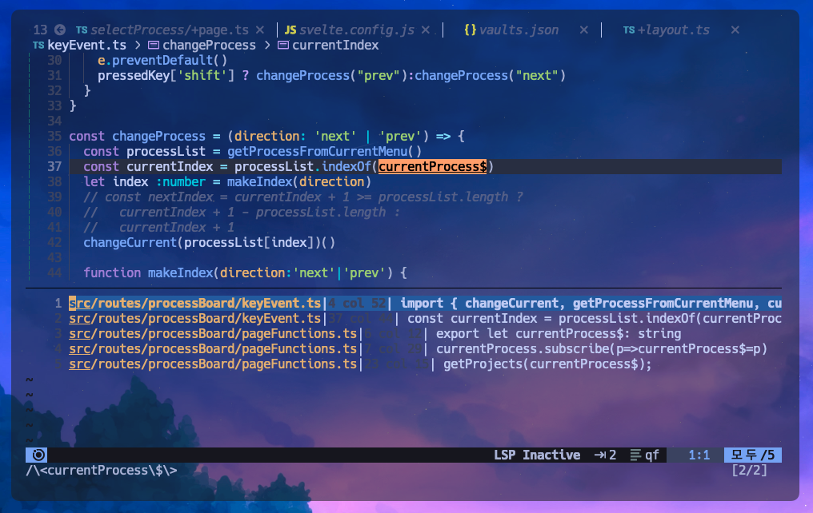

# `*` asterisk로 변수명을 리팩터링해보자
## 한 파일 내부의 변수명을 변경할 경우

루나빔에서 특정 변수의 이름을 모두 변경해야할 때가 있다.
이때 `*` 키의 도움을 받으면 편하다. 노멀모드에서 커서를 특정 변수명에 위치놓고 `*`
키를 누르면 자동으로 해당용어 전체를 셀렉션 해주게 된다. 일종의 매크로인 셈인데 `/변수명` 을 자동으로 입력해주어 검색을 도와주는 도구이다.

(빔에서는 노멀모드에서 `/` 키를 누르고 키워드를 입력하면 현재 활성화된 문서 전체에서 해당 키워드를 검색하고 셀렉션해준다.)

이제 셀렉트된 변수의 이름을 바꿔보자.

노멀모드인 상태로 
1. `ciw` 를 순서대로 입력하면 
   커서가 단어의 중간에 있어도 단어의 시작점부터 변경하게끔 단어를 삭제하고 인서트 모드로 전환된다. 
2. 변수의 이름을 name으로 변경하고 
3. 인서트 모드를 종료(`esc`)하면 
   방금 변환했던 행위가 빔의 `.` 매크로에 기억되어있기 때문에 반복 가능하다.
4. `n` 키를 눌러서 셀렉션된 다음 대상으로 이동할 수 있고, 
5. `.` 키로 이전에 햇던 작업을 반복하면 변수명 변환 리팩터링이 완료된다.

## 여러 파일에 걸친 변수들을 리팩터링해보자

방법은 다르지 않다. 루나빔에서는 변수를 레퍼런스 삼는 모든 지점들을 찾아내주는 기능이 있다. 단축키는 `g` + `r`(reference)을 기본값으로 한다. 

> **참고** 
> `g` + `d`(definition)
> `g` + `l`(lsp error, warn...)

1. 변경할 이름을 찾아서 `*`을 먼저 눌러주고, 
   해당 이름을 사용하는 레퍼런스를 검색하여 하나씩 변경하면 된다. 그러면 현재 파일에서 해당 이름을 사용하는곳을 모두 검색하면서 이 이름을 사용하는 모든 파일의 위치를 찾아준다. 
2. 포커스가 현재 레퍼런스 창에 가있기 때문에 `Enter`키를 입력하면 해당 레퍼런스 위치로 이동하게 되고, 
3. 이때 `c` + `i` + `w` 를 눌러 용어를 변경하면 매크로에 입력된다. 
4. 해당파일에서 다음 변수를 찾기위해 `n` 키를 입력하여 다음 셀렉트 변수를 찾아내고 
5. `.` 키를 눌러 이전에 입력된 이름변경 매크로를 실행시켜준다.
6. `ctrl` + `j` (빔 윈도우 포커스 아래 윈도우로 이동) 키를 눌러 포커스를 레퍼런스 리스트로 옮겨주고
7. 작업한 파일 외부의 파일로 이동하여 이름변경을 반복해준다.

