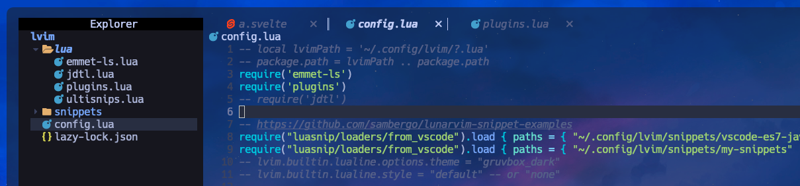

# 루아파일 분리하기

루나빔의 설정폴더에 가면 컨픽파일만 덩그러니 있는데, 여기에 조금 설정값을 추가하다보면, 파일 크기가 점점 커져서 가독성이 떨어지게 되는 문제가 발생한다.

루아파일도 가벼운 프로그래밍 언어이다보니, 모듈화시킬수 있는데, 기본적으로 require키워드를 사용한다.

루아파일의 모듈 특징은 `lua` 폴더에 들어가 있어야 한다는 점이다.



필자는 컨픽파일을 현재 이렇게 사용중이다.

컨픽파일에서 별도의 루아파일을 불러올 때 lua폴더에 있는 루아파일을 불러온다는점을 주의하자.

만약 루아파일 내부에 새로운 폴더를 만들고 그 내부에 루아파일을 불러올때는 몇가지 규칙이 있다


위 그림과 같이 모듈을 불러오려면 다음의 규칙을 준수하면 된다.
1. `lua/` 아래에 존재해야한다
2. `lua/file.lua` : `require filename`
3. `lua/folder/init.lua` : `require "folder"`
4. `lua/folder/file.lua` : `require "folder.file"`

```lua filename="lua/custom/init.lua"
print("custom init.lua print")
```

```lua filename="lua/other/print-hello.lua"
print("hello by print-hello.lua")
```

입력해놓고 빔을 다시 켜면 설정파일이 로드되면서 다음과 같은 프린트가 뜬다.


루아파일 가져올때 종종 오류메시지가 뜨는데, 종료후 실행해봐야 해결되는 케이스가 있다. 오류메시지 없에려고 너무 노력하지 말고, 설정이 잘 완료되면 일단 빔을 재부팅해보자.
