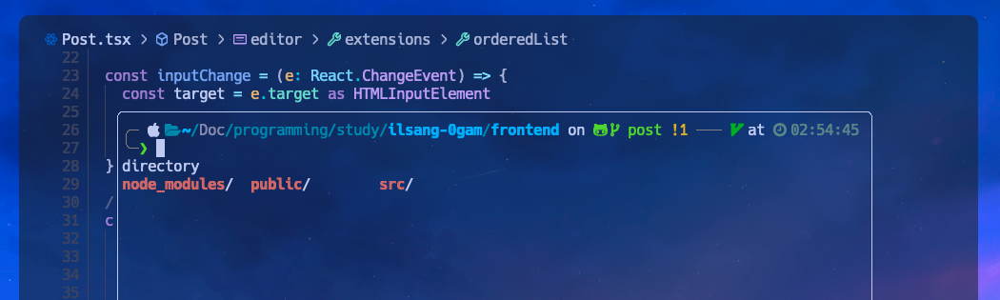

# 플로팅 터미널 사용하기

루나빔에서 특별한 설정없이 터미널을 사용하는 방법은 다섯가지 정도가 있다.

1. `:terminal` 명령어를 입력해 새탭에 터미널을 띄우
2. `Meta` + `1` 키를 입력해 하단 스플릿 터미널 띄우기
3. `Meta` + `2` 키를 입력해 우측 스플릿 터미널 띄우기
4. `Meta` + `3` 키를 입력해 플로팅 터미널 띄우
5. `ctrl` + `\` 키를 입력해 터미널 토글하기

필자의 맥북에는 무슨일인지 메타키(커맨드키)가 먹히지 않아 2,3,4번 단축키 사용을 하지 못하고 있다. 남은 방법은 1번과 5번인데 

1번은 매우 번거로울 뿐만 아니라 탭에 있을 때 터미널에 포커싱 되어있다면 포커싱을 강제로 종료하는 방법을 못찾았다. 그래서 터미널을 매번 종료해야만 하는 번거로움이 있다.

5번 선택지를 사용한다면 자동적으로 플로팅 터미널이 뜨게 된다. (버퍼에 다른 옵션의 터미널이 없을경우 기본값)

