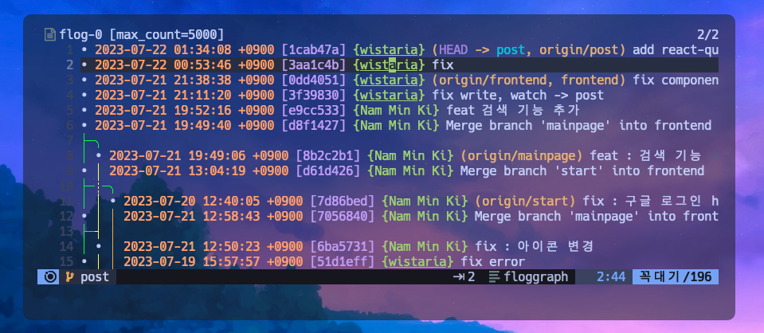
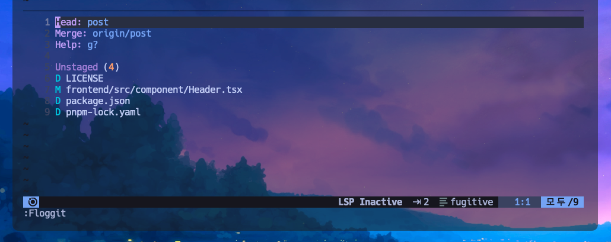
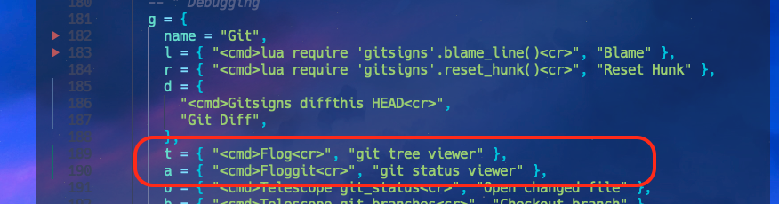

# `Flog` 깃 커밋 트리 뷰어

여타 IDE를 사용할때면 누가 어떤 작업을 진행했고 푸시했는지 확인시켜주는 도구들이 있다. vscode 에서는 깃렌즈라던지 훌륭한 익스텐션이 존재한다. 빔에도 마찬가지로 쓸만한 플러그인이 있다. 이번에 소개할 프로그 플러그인이다.



프로그를 사용하면 위처럼 소스트리를 한눈에 볼 수 있다. 텍스트기반이다보니 여타 IDE들이 그래픽으로 보여주는 정도까지의 화려함은 없지만 개발자 특유의 멋을 낼 정도는 충분하다. 

설치는 간단하다.

```lua filename="~/.config/lvim/config.lua"
lvim.plugins = {
  -- git viewer
  {'rbong/vim-flog'},
  {'tpope/vim-fugitive'},
```

플러그인 객체에 붙여넣고 빔을 리부팅 시키면 된다.

설치가 완료됐으면 노멀모드에서 `:F` 키를 입력해 플러그인을 활성화 시켜보자. 실행 명령어는 세가지다.

- Flog (트리뷰어)
- Floggit (스태이터스 보기)
- Flogsplit (트리뷰어 왼쪽에 스플릿뷰로 보기)



Floggit을 입력하면 위와같은 화면이 나타나고 각 문서의 상태를 알수있다. Header가 변경되고, LICENSE가 삭제되었다.

매번 명령어를 입력하기 곤란하니 단축키를 등록해보자.
`~/.local/share/lunarvim/lvim/lua/lvim/core/which-key/lua` 파일에서 g (git) 키를 찾아 다음과 같이 수정해준다.



이제 잘 동작한다.

