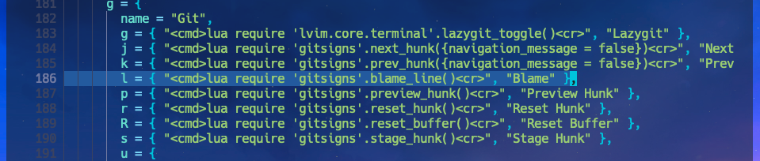
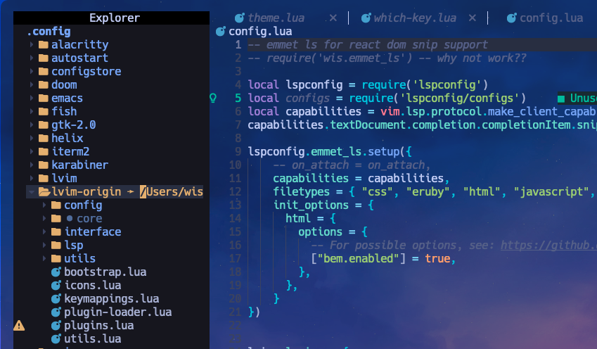

깃 단축키는 위치키(플러그인)에 매핑되어있다.

`~/.local/share/lunarvim/lvim/lua/lvim/core/which-key/lua` 에 설정되어있다.



설정파일에 접근하기가 불편하니 다음과 같이 바로가기를 만들어두는 편이 좋다.



Link를 만드는 방법은 다음과 같다.

```shell
> ln -s ~/.local/share/lunarvim/lvim/lua/lvim ~/.config/lvim-origin
```
