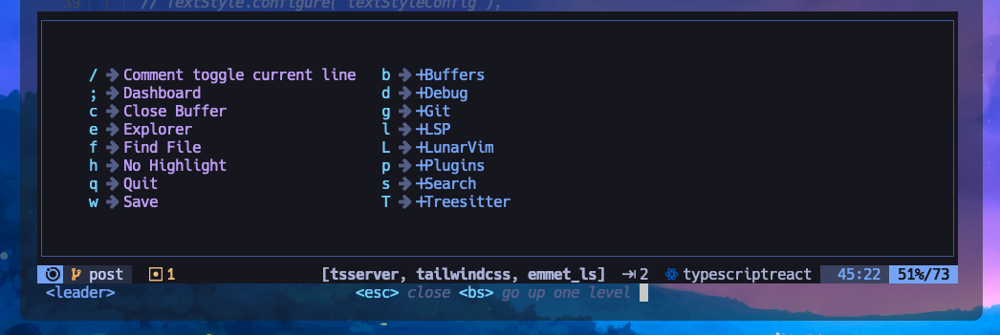
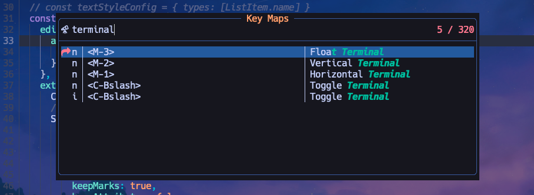

# 기능 단축키 검색하기

이번 팁은.. 사실 조금만 관찰해도 쉽게 찾을 수 있다. 위치 키에서 해당 기능을 소개해주고 있기 때문이다.

빔의 단축키 명령어는 위치키(루나빔 기본내장)를 통해 수많은 조합으로 매핑될 수 있는데, 루나빔은 기본적인 셋팅값들이 제법 많이 매핑되어있다. 지금 소개할 키맵핑 정보 찾는 기능도 이미 매핑되어있다.

루나빔에서 스페이스(빔에서는 리더키라고 부른다)를 누르고 약 0.5초간 기다리면 사용자가 학습이 덜 됐다는 판단하에 키기 어떤 구성인지 소개를 해준다.

여기서 `s`가 서치인걸 확인할 수 있고 눌러보면 `k`에 키맵이 매핑되어있다고 나타난다. 해당 키를 누르면 다음과 같은 검색화면이 뜬다.

검색어를 입력하면 해당기능에 대한 단축키를 찾아낼 수 있다.

